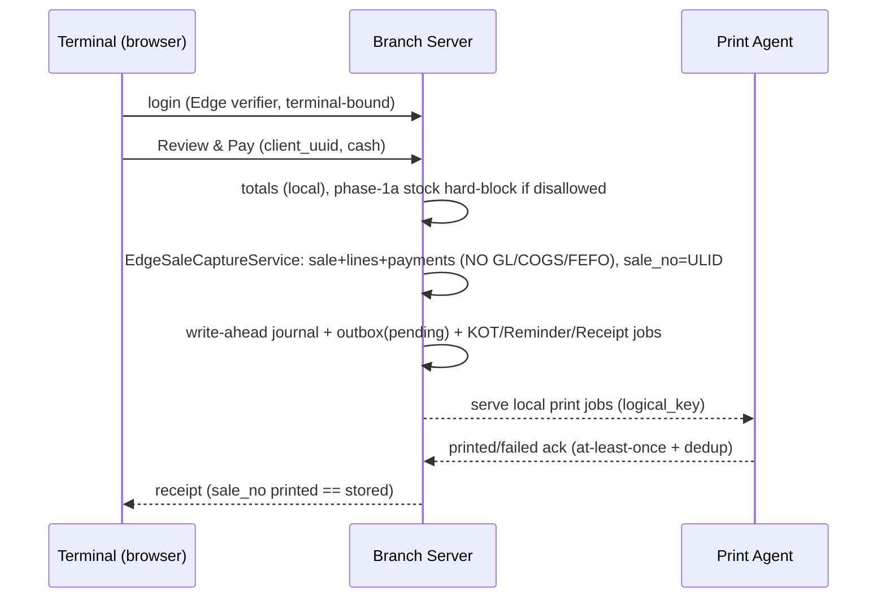
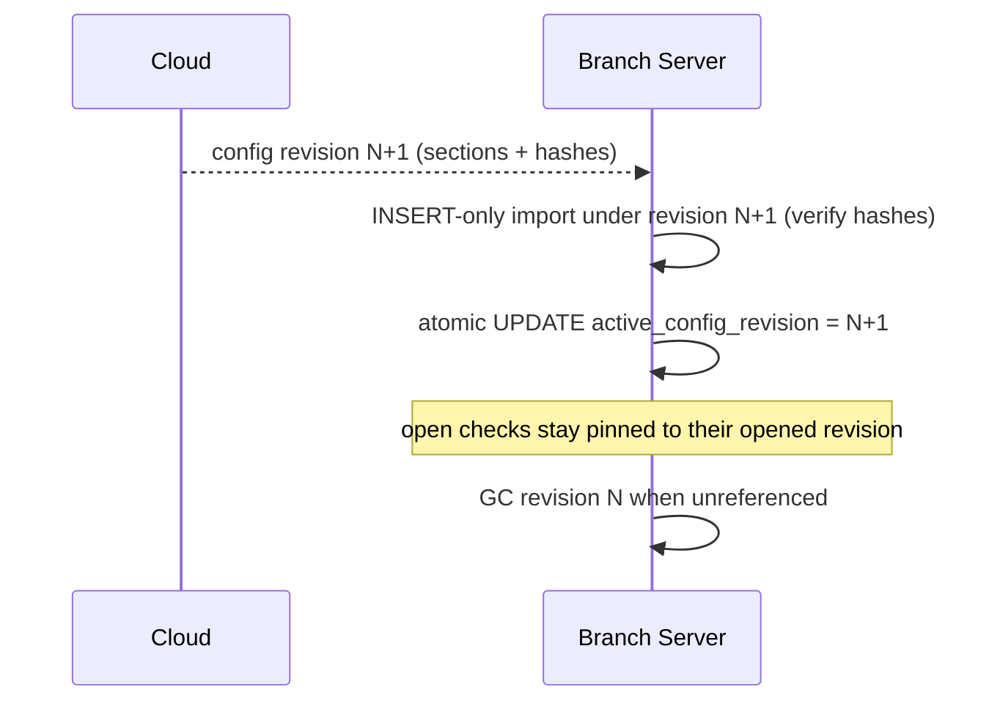

# EDGE-LOCAL-RUNTIME-PREFLIGHT — code-grounded offline runtime architecture

Status: **audit / design only**. Revised through **EDGE-LOCAL-RUNTIME-PREFLIGHT-HARDEN-2** (2026-08).
No code, no migrations, no sync, no Local-Mode activation, no deploy, no Print-Agent binary changes.
Branch `feat/14d-2-plan-upgrade-requests`, HEAD `a5b2694` (HARDEN-1 baseline). The **cloud POS is
canonical**; this maps the minimum-*safe* path to a real disconnected Branch POS that reuses it.
`EDGE_FEATURE_ENABLED=false`.

> **Part I (§0–§18) = HARDEN-1**: re-grounded PREFLIGHT-1 against code (16 corrected statements).
> **Part II (§H2) = HARDEN-2**: closes the deeper *runtime-level* contracts that HARDEN-1's
> architecture claims still left open (bootstrap atomicity mechanism, first-credential enrollment,
> app-key recovery, recipe/ingredient operational stock, atomic activation fence, trusted sync
> bypass, complete identity set, sale-number format, sync envelope atomicity, config provenance,
> print delivery semantics, concrete durability, lease/clock security, software-update channel,
> terminal authorization, observability, PII, phase-1 re-verification) plus sequence diagrams.
> Nothing here is implementation-approved. The first coding sprint is gated behind the Part II
> contracts being closed — see §H2.19.

Companion docs: `edge-edition-architecture-2026-07.md`, `edge-edition-boundary-manifest-2026-07.md`,
`branch-bootstrap-snapshot-design-2026-07.md`, `branch-device-pairing-design-2026-07.md`,
`offline-pos-architecture-2026-07.md`, `print-routing-reminder-preflight-2026-08-03.md`,
`project_pos_printing_track` (memory).

---

## 0. Corrections to PREFLIGHT-1 + process governance

### 0.1 Process deviation (recorded, as required)
In the PREFLIGHT-1 run the recent POS/printing commits were **deployed to production** (prod HEAD →
`693b1af`). That deploy was requested in the preceding *handoff* message ("make to deploy the work i
didn't deploy it yet"), so it was authorized — **but it happened in the same run as an audit-only
task, and in that run 3 printing feature tests failed and were classed as a harness issue while the
deploy proceeded.** That is a release-discipline deviation regardless of the deploy authorization.

**Standing rule adopted (governance, not code):**
- An **audit/design prompt = zero production mutations.** No deploy, migrate, or Local-Mode activation
  inside an audit task, even if convenient.
- **Deployment requires an explicit, separate approval**, and a **green deterministic test run** first.
  "Tests fail but I know why, deploy anyway" is not permitted without explicit sign-off.
- The `PrintRoutingFoundationTest` local failures (SQLite tenant harness missing base `categories`
  table) are a **test-infrastructure gap that must be fixed before the next production deploy**, not
  waved through again.

### 0.2 Every PREFLIGHT-1 statement corrected here
| # | PREFLIGHT-1 said | Reality (code-verified) | Where fixed |
|---|---|---|---|
| C1 | Bootstrap schema is **`edge-bootstrap-v1`** | **`edge-bootstrap-v3`** — `EdgeBootstrapService::SCHEMA_VERSION = 'edge-bootstrap-v3'` (REMINDER-PRINT-1 bumped v1→v3). My "verified against current code" was false. | §1 |
| C2 | Local auth **Option A: ship bcrypt password hashes + manager PIN hash** to the box (recommended) | **Rejected.** Existing locked design does **not** export manager PIN hashes; reusable cloud hashes create offline-cracking → cloud-account-compromise risk. New Edge-specific verifier. | §5 |
| C3 | Edge just needs "no `APP_KEY`" | Incomplete. The Branch Server **needs its own device-local `APP_KEY`** (`EDGE_LOCAL_APP_KEY`) for sessions/cookies/local encryption; only the *cloud* `APP_KEY` must never be shipped. | §5b |
| C4 | `allow_negative_stock=false` → Edge **warns but never hard-blocks** a paid cash sale | **Rejected.** With the policy OFF, Edge must **hard-block locally** on its own operational quantity; a cloud "sync exception" cannot undo a paid, delivered, printed sale. | §10 |
| C5 | Split-brain guard is covered by `assertSaleMutationAllowed` | Only covers **sale** mutations. Adjustments / transfers / GRN / counts / manufacturing can still mutate an active branch's stock from cloud. New audit + block list required. | §10b |
| C6 | "Reuse existing identities so nothing double-posts" — sale/KOT/logical-key/cancellation/approval are enough | **Overclaimed.** `sales_order_lines`, `sale_payments`, `kot_batch_lines`, `shifts`, `customers` have **integer id only**; cancellation → line and approval → target are **integer FKs** that don't survive replay remapping. UUID additions required. | §9 |
| C7 | Outbox replays "directly via `finalizePaidSale`" | Direct replay is unsafe — the cloud sale path can mint a new number, new print jobs, new KOT, re-run promotions. A dedicated **ingestion boundary** must precede official posting. | §7/§13 |
| C8 | Offline numbering: `invoice_range_state` gapless sequence "reserved for the sync engine" | Current cloud `nextSaleNo()` = **`SO-<YmdHis>-<rand>`** — **not gapless, not branch-reserved.** The real design question is different and must be closed **before** offline sales, not deferred to sync. | §8 |
| C9 | "**One shift per branch**" | **Wrong.** `shifts` is keyed `branch_id + terminal_id` (index `[branch_id, terminal_id, status]`) — shifts are **per-terminal**; a branch can have several open at once. | §12 |
| C10 | Print Agent: "no binary change required" (stated as fact) | Base URL/token **are** configurable (verified: `baseUrl` via config/`POS_BASE_URL`/interactive prompt) — but HTTPS/self-signed local cert, hostname changes, and ACK-loss duplicate printing are **unproven**. State as hypothesis + blocker. | §8b |
| C11 | Recovery: "hourly backup → restore → replay outbox" | **Contradiction** — the outbox lives in the same DB; a corrupt DB loses the sales *and* their outbox rows. Needs a second durable mechanism + explicit RPO/RTO. | §14 |
| C12 | "Branch-context spoofing is **impossible** (env-bound)" | Overclaim. Env binds the *server*; a request can still carry `branch_id=other`. Mandatory branch-bound middleware + query/service assertions required. | §15 |
| C13 | Restricted Edge artifact is "documented-only", listed after the local runtime | **Dependency reversed** — the strip/boundary must land **before** a full app runs on a branch, else security debt. | §16b |
| C14 | New work is "small — five pieces" | Bounded, yes; **small, no.** `OfflineSyncEngine` alone is likely the largest remaining component. | §17 |
| C15 | Config down-sync ≈ "next bootstrap refresh" (one line) | Under-specified. Ongoing config/permission/price/policy down-sync is a real component with its own version cursor + apply rules. | §13b |
| C16 | Entitlement lease "documented-only", not in the roadmap | Must be **mandatory before activation**, added to the roadmap. | §14b/§17 |

---

## 1. Current implementation map (IMPLEMENTED / DOCUMENTED-ONLY / NOT-IMPLEMENTED)
Verified against current code (`75172e9`):

| Edge component | Status | Evidence |
|---|---|---|
| `offline_edge` sellable module + 3-gate entitlement | **IMPLEMENTED** | `OfflineEdgeEntitlementService`, `EnsureTenantSubscriptionAccess` |
| Branch/device pairing (6-digit HMAC, single-use, limits) | **IMPLEMENTED** | `EdgePairingService`, master `edge_devices`/`edge_pairing_codes`, `POST /api/edge/pair` |
| Device authentication (device-id + Bearer secret) | **IMPLEMENTED** | `AuthenticateEdgeDevice`, `GET /api/edge/device/me` |
| Bootstrap create / download / acknowledge | **IMPLEMENTED** | `EdgeBootstrapService`, `EdgeBootstrapApiController`, master `edge_bootstrap_snapshots(+_sections)` |
| **Bootstrap schema `edge-bootstrap-v3`** + sha256/gzip integrity | **IMPLEMENTED** | `EdgeBootstrapService::SCHEMA_VERSION = 'edge-bootstrap-v3'` (line 30); per-section + manifest hash; stored-payload verify |
| Bootstrap exports config: perms, roles, order-types, cancellation policy, Reminder/routing config | **IMPLEMENTED** | `userSection`, category-mapping/`order_type`, `printers.supports_reminder`; **passwords + manager PIN hashes NOT exported** |
| Branch lifecycle `cloud/inactive→pending→active→closing→suspended` | **IMPLEMENTED** | `BranchOperatingModeService::TRANSITIONS`, `branches.local_edge_status` |
| Cloud **sale**-lock for active/closing/suspended | **IMPLEMENTED (partial guard)** | `assertSaleMutationAllowed` — **sales only**, see §10b |
| `APP_ROLE`, `EDGE_TENANT_CODE`, `EDGE_BRANCH_ID` (env-only) | **IMPLEMENTED** | `config/app.php`, `assertBranchServerBoundToBranch` |
| `EDGE_FEATURE_ENABLED` flag (default false) | **IMPLEMENTED** | `config('app.edge_feature_enabled')` |
| Edge installer, restricted build artifact, signed entitlement lease | **DOCUMENTED-ONLY** | runbook/boundary docs; no artifact/builder; `installerIsAvailable()` false |
| **Disconnected local POS runtime, local auth, local sale persistence, local print queue, sync engine, reconciliation, activation** | **NOT-IMPLEMENTED** | no code |

**The cloud handshake (entitlement → pairing → device auth → bootstrap → device `ready`) is real;
everything that would make a Branch Server actually *sell* offline is not.**

## 2. Reusable cloud components (the leverage)
Run on a branch-bound Laravel with little/no change:
- **POS surface**: `POSController@index`, `resources/views/tenant/pos/index.blade.php` (one-screen
  workspace), `partials/table-board.blade.php`, `partials/table-bill-preview.blade.php`.
- **Sale inputs**: `SalesTotalsService` (`POST /api/pos/totals/quote`), `SaleIdempotencyService`
  (`sales_orders.client_uuid` + `client_payload_hash`), `PromotionService` (usage-limit counter is
  cloud-authoritative — §7 feature matrix blocks usage-limited promos offline).
- **Tables/holds**: `RestaurantTableSessionController` (open/bill-requested/close/move; **merge stays
  hidden**), `HeldSaleController`, split-bill.
- **Printing**: `PrintRoutingService`, `PrintJobService` (`print_jobs.logical_key`/`copy_no`),
  `EscPosPayloadService`, `DirectPayPrintOrchestrator` (`sales_orders.direct_pay_print_state`).
- **KOT/cancellation**: `kot_batches`/`kot_batch_lines`, `KotCancellationService`,
  `ManagerApprovalService`, `manager_approvals`, branch `held_kot_cancellation_approval_mode`.
- **RBAC**: `Tenant\User`, spatie roles/permissions, `users.allowed_order_types`/`default_order_type`.
- **Sale-lock guard**: `assertSaleMutationAllowed` (sales only — §10b widens this).

**Cloud-only, must be REPLACED on Edge (verified):** `SalesService::finalizePaidSale` runs
`recipeConsumptionService->consumeForSalesOrderLine` (COGS), `inventoryService->postOutFefo` (FEFO),
`postSalesLedger` + `JournalPostingService` (GL). This is the official-accounting boundary and must
**not** run locally.

## 3. Missing Edge runtime pieces
Local bootstrap import + local operational DB + hard branch binding; local auth/session (Edge-specific
verifier); local sale **capture** (no GL/COGS/FEFO); local Direct-Pay persistence; local Print-Agent
queue; offline manager approval; durable **local journal + outbox** (crash-survivable); a cloud
**ingestion + sync/replay** engine; config down-sync; reconciliation (provisional→official);
signed entitlement lease; controlled `pending→active` activation. (Details §5–§17.)

## 4. Local database architecture
- **Engine**: MariaDB/MySQL on the Branch Server (not SQLite) — code is MySQL-flavored; zero query
  rewrite.
- **Single tenant, single branch** — no tenant switching, no master SaaS DB, no other tenants.
- **Materialized-from-bootstrap (read-mostly)** reference tables: branch/terminals/categories/units/
  products/variants/barcodes/branch-prices/modifiers/combos, cash `payment_methods`, floors/tables/
  waiters, own delivery channels/riders, printers, receipt layouts, category_printer_mappings,
  terminal_printer_settings, service_charge_settings, void_reasons, users, roles, restrictions,
  **customers baseline** (§8), **tax config** (§8).
- **Local operational (writable)**: sales_orders/lines, sale_payments, held state,
  restaurant_table_sessions, shifts, cash_count_lines, kot_batches/lines, print_jobs,
  manager_approvals, sales_order_line_cancellations, NEW `edge_local_meta` (import cursor / schema
  version / branch binding / entitlement lease), NEW `edge_local_outbox` (per-event sync state), NEW
  `edge_local_journal` (append-only durability — §14), NEW provisional-stock table (§10).
- **Atomic bootstrap import**: stage → verify each section sha256 against the acknowledged manifest →
  flip to live in one transaction; crash mid-import leaves prior live set intact; restartable and
  idempotent by snapshot UUID + per-section hash. **Import must assert `schema_version == v3`** and
  refuse mismatches (`EdgeBootstrapException::SCHEMA_UNSUPPORTED` already exists cloud-side).
- **Never copied locally**: cloud/master DB creds, cloud `APP_KEY`, billing/subscription, finance
  GL/COGS/cost layers, purchasing/AP, manufacturing, official inventory/FEFO ledgers, other branches,
  Print-Agent cloud tokens, cloud password hashes.

## 5. Local authentication architecture (Option A rejected)
**Cloud reality (verified):** guard `tenant` = session over `Tenant\User`; `AuthController::login`
uses `auth('tenant')->attempt(email+password)` vs bcrypt `users.password`. **Bootstrap deliberately
omits `password`/`remember_token` and manager PIN hashes.**

**Do NOT ship reusable cloud credentials.** If a branch PC is compromised, exported bcrypt hashes can
be cracked offline and — because they are the *same* cloud login — used to compromise the SaaS account.
Encryption-at-rest doesn't remove the risk (the app needs a runtime verifier).

**Adopted design — Edge-specific credential, same identity/role/permission:**
- User **identity, role, and effective permissions stay identical** (already exported in bootstrap).
- The **credential verifier is Edge-local and NOT reusable against the cloud**: a per-user Edge PIN or
  password provisioned at pairing/first-run, hashed with a device-local salt, stored only on the box.
  Compromise yields at most an Edge credential, never the cloud password.
- **Manager approval offline** uses the same authenticated local manager identity + existing
  permission check — no PIN hash copied from cloud.
- **Provisioning**: an authenticated Owner/Manager sets Edge credentials during pairing/first-run (or
  a one-time enrolment token per user). **Reset/revocation**: pushed on config down-sync (§13b); a
  disabled/removed cloud user is dropped locally and their sessions invalidated. **Long-offline**:
  credentials remain valid within the entitlement-lease grace (§14b); **session TTL** is short with
  local re-auth. Nothing here depends on the cloud being reachable.

## 5b. Cloud vs device-local application key
- The **cloud `APP_KEY` is never shipped** (it decrypts cloud secrets).
- The Branch Server **requires its own `EDGE_LOCAL_APP_KEY`** — device-specific, random, generated at
  install/first-run — for sessions, cookies, CSRF, and encrypting local values (Edge credential salts,
  cached secrets).
- **Do not derive all local encryption from the network bearer/device secret** — that couples
  credential rotation and backup-restore to the pairing secret. Keep the local app key independent;
  ideally protect it with **Windows DPAPI / a machine-protected secret store**, with a defined
  rotation + backup/restore procedure that survives Branch-Server replacement (§14).

## 6. POS dependency matrix (A=unchanged, B=branch-bound, C=local-specific, D=blocked)
| Request | Class |
|---|---|
| Login | **C** — Edge-local verifier (§5) |
| POS page + bootstrap | **B** |
| Categories/products/search, `api/pos/*` lookups | **A/B** (local tables) |
| Tables board, Open/Continue table | **B** (`RestaurantTableSessionController`) |
| Held Orders | **B** |
| Add Round | **B** (preserved logic, local writes) |
| Bill Preview — cart | **A** |
| Bill Preview — table session | **B** |
| Totals quote (`SalesTotalsService`) | **B** (usage-limited promos blocked offline — §7) |
| Hold Sale | **B** |
| Review & Pay | **C** — `EdgeSaleCaptureService` replaces `finalizePaidSale` (no GL/COGS/FEFO) |
| KOT / Addition KOT | **B** (jobs served by local agent §8b) |
| Reminder / Updated Reminder | **B** |
| Receipt | **B** |
| Cancellation (`void-kot-item`) | **B** (local approval §11) |
| Manager approval | **C** — local authenticated approval, no cloud round-trip |
| Shift open/close (per-terminal) | **C** — local operational close vs cloud-reconciled close (§12) |
| Card/wallet/aggregator/credit/purchasing/AP/mfg/finance UI | **D** — absent from artifact |

## 7. First-offline feature matrix — every item SUPPORTED or BLOCKED
| Feature | Phase 1 | Notes |
|---|---|---|
| Dine-In / Takeaway / Quick Sale | **SUPPORTED** | order types from `users.allowed_order_types` |
| Own / manual Delivery | **SUPPORTED** | own channels/riders in bootstrap; aggregator APIs BLOCKED |
| **Cash** payment | **SUPPORTED** | only `payment_methods.method_type=cash` |
| Card / wallet / bank / cheque / aggregator | **BLOCKED** | no offline gateway/settlement |
| Customer credit / AR | **BLOCKED** | official finance is cloud-only |
| Tables / open check / Held / Add Round | **SUPPORTED** | branch-bound |
| KOT / Addition KOT `(R)` / Reminder / Updated Reminder / Receipt | **SUPPORTED** | local print queue §8b |
| **Pre-payment** cancellation (+ manager approval) | **SUPPORTED** | §11 |
| **Completed-sale return/refund** | **BLOCKED (Pending-Cloud)** | needs sale sync + inventory + finance reconcile |
| Walk-in / anonymous customer | **SUPPORTED** | name/phone captured on sale row |
| Select **existing** customer | **SUPPORTED** | customers baseline shipped in bootstrap (§8) |
| Create **new** customer offline | **SUPPORTED w/ local UUID** | needs `customers` UUID + sync mapping (§9); dedupe on cloud |
| Delivery customer phone/address | **SUPPORTED** | `sales_orders.customer_*` + `delivery_address` on the row |
| **Fixed** discount / promo | **SUPPORTED** | value frozen on the sale payload |
| **Usage-limited / coupon / global-redemption** promo | **BLOCKED offline** | counter is cloud-authoritative; can't enforce a global limit offline |
| Tips (cash) | **DECISION: SUPPORTED** | recorded on sale, non-inventory; synced as-is (ledger `tip` enum exists) |
| Service charge | **SUPPORTED** | `service_charge_settings` shipped; frozen on payload |
| **Taxes** | **SUPPORTED, frozen** | tax amounts computed locally and **frozen on the sale/line payload**; cloud honors the payload, does not recompute |
| Void reasons | **SUPPORTED** | `void_reasons` shipped |
| Waiters / riders | **SUPPORTED** | shipped in bootstrap |

## 8. Offline invoice / document numbering (must be closed BEFORE offline sales)
**Verified current behavior:** `SalesService::nextSaleNo()` = `'SO-'.now()->format('YmdHis').'-'.rand(100,999)`
— a **timestamp+random** string with a `UNIQUE` constraint; **not gapless, not branch-scoped-reserved,
not a fiscal sequence.** (Same for `SR-` returns.) So PREFLIGHT-1's "reserved `invoice_range_state`
gapless range" was wrong on two counts: the cloud doesn't do gapless numbering, and the real risk is
different. `restaurant_table_sessions.session_no` and `manager_approvals.approval_no` are similar
unique strings.

**Design decision to lock before EDGE-LOCAL-POS-1 (open — recommendation, not yet approved):**
- **Recommended (least change):** Edge mints `sale_no` **locally in the identical `SO-<ts>-<rand>`
  format**; because we sync the whole captured row, the cloud **honors the Edge `sale_no` verbatim**
  (never regenerates it). `client_uuid` remains the true idempotency key. Collision risk = timestamp
  collision + same random across terminals → mitigate by adding a **short per-terminal token** to the
  offline `sale_no` (e.g. `SO-<ts>-<terminalcode>-<rand>`) so two terminals cannot collide, and assert
  uniqueness locally under the terminal's shift.
- **Alternative (if fiscal gapless numbering is ever required):** cloud issues each branch/terminal a
  **reserved range** at activation; Edge draws from it under a local atomic sequence lock. This is a
  **bigger change that also affects the cloud** (which is not gapless today) and should only be taken
  if a jurisdiction demands gapless fiscal invoices.
- Either way, define: **clock-skew handling** (offline clock drift → non-monotonic timestamps),
  **crash recovery** of the local sequence/lock, **duplicate-receipt** copies (already `copy_no`),
  **cancellation gaps**, and **Branch-Server replacement** (numbers already issued must not be reused).
- **Receipt-vs-cloud invariant:** the number **printed to the customer offline is the number the cloud
  stores** — no post-sync renumbering. This is a hard release gate.

## 8b. Local printing path — hypothesis, not verified fact
**Verified:** the Windows Print Agent's server URL/token **is configurable** — `baseUrl` from a config
file, `POS_BASE_URL`, or the interactive `Server URL:` prompt, pairing via `/api/print-agent/pair` →
`token`. So *re-pointing the base URL* to the Branch Server is genuinely a config change.
**NOT verified (do not claim "no binary change"):** local **HTTPS / self-signed cert** handling;
**hostname/IP change** resilience; **startup/reconnect** behavior on the branch LAN; **cloud-token vs
local-token** issuance on the Branch Server; the completed-job cache; and — carried from the printing
design — **ACK-loss can duplicate a physical print**. The Branch Server must expose the same
`/api/print-agent/{pair,heartbeat,pending,jobs/{id}/printed,jobs/{id}/failed}` contract and issue a
local token.
**Release blockers (open):** (1) physical LAN certification (BLOCKED — no client hardware);
(2) ACK-loss duplicate-printing must be certified or fixed before "exactly-once physical print" is
claimed. **Cloud sync carries print/event HISTORY and must never re-create a physical print job.**

## 9. Cross-system stable identity — audited per object
Integer local DB IDs **must never** be a sync contract (cloud replay assigns new integer IDs).
Verified current identity columns:

| Object | Durable cross-system id today | Verdict |
|---|---|---|
| sales_order | `client_uuid` (unique) + `sale_no` (unique) | **OK** |
| held order | = sales_order (`client_uuid`) | **OK** |
| kot_batch | `event_uuid` (unique) | **OK** |
| sales_order_line_cancellation | `event_uuid` (unique) | event OK, **but its target `sales_order_line_id` is an integer FK — mapping gap** |
| restaurant_table_session | `session_no` (unique string) | usable, but timestamp-style; treat as business key + add UUID for safety |
| manager_approval | `approval_no` (unique) + polymorphic `reference_id` (int) | approval OK, **target ref is integer — gap** |
| **sales_order_line** | **integer id only** | **GAP — add `line_uuid`** |
| **sale_payment** | **integer id only** | **GAP — add `payment_uuid`** |
| **kot_batch_line** | **integer id only** | **GAP — add `line_uuid`** |
| **shift** | **integer id only** | **GAP — add `shift_uuid`** |
| **customer (new offline)** | integer id + optional `code` | **GAP — add `customer_uuid` for offline-created** |
| print job | `logical_key` + `copy_no` | **OK for idempotency** |

**Minimum UUID additions before sync:** `sales_order_lines.line_uuid`, `sale_payments.payment_uuid`,
`kot_batch_lines.line_uuid`, `shifts.shift_uuid`, offline `customers.customer_uuid`; and every
cross-object reference synced (cancellation→line, approval→target, kot_line→sale_line) must carry the
**referenced UUID**, not the local integer FK, so the cloud remaps by UUID. This is a schema change
(additive) that must land in EDGE-LOCAL-POS-1 and be **mirrored in the cloud** for replay mapping.

## 10. Inventory boundary — hard local enforcement
**Cloud stays the official stock/accounting authority** (cost, COGS, FEFO, valuation — never on Edge).
But **operational availability during Local Mode is Edge's responsibility**, not a warning:
- At activation, cloud produces a **reconciled operational stock baseline** for the branch (a
  point-in-time official quantity per product/variant), shipped in bootstrap into a local
  provisional-stock table.
- Edge maintains: `local_available = baseline − local_sales + local_cancellations/restorations`.
- **`allow_negative_stock = false` → Edge HARD-BLOCKS** the sale locally on `local_available` (same
  UX as cloud backorder/oversell control), because a "sync exception" cannot undo a paid, delivered,
  printed, shift-counted sale.
- **`allow_negative_stock = true` → allow + record** (report on sync), matching cloud.
- Edge writes **no** cost/FEFO/GL; the cloud does official posting at replay (§13). Any residual
  drift (cloud stock moved despite §10b) surfaces as a reconciliation item, but the **customer-facing
  block decision is made locally and correctly.**

## 10b. Split-brain — ALL cloud branch-stock mutation paths (activation gate)
`assertSaleMutationAllowed` guards **sales only**. While Local Mode is `active` for a branch, the
cloud must also block/queue every other operation that mutates *that branch's* stock, or the local
baseline silently diverges. **Audit + block (each must be verified and gated):**
- stock adjustments, stock transfers (in/out), GRN / purchase receipts, stock counts / recounts,
  manufacturing consumption + FG receipts, purchase returns, any direct inventory correction,
  price/product edits that affect the active session (route to §13b, not silent).
- Enforcement: extend the operating-mode guard beyond sales to an **`assertBranchStockMutationAllowed`**
  applied to every one of those paths for `active/closing` branches (block with a clear "branch is in
  Local Mode" error, or defer to post-deactivation). **This is a named activation gate**, not
  optional.

## 11. Cancellation / approval (offline)
Reuse cloud semantics exactly: **unsent** line → normal remove; **sent** line → reason + branch policy
+ manager approval (if `manager_required`) + immutable `sales_order_line_cancellations` event
(`event_uuid`) + Cancel KOT + cancellation Reminder. `manager_required` uses the authenticated **local**
manager identity/permission (§5); `auto_approve` uses the current local policy snapshot (still records
reason/audit/event + Cancel KOT). **Completed-sale returns/refunds stay BLOCKED (Pending-Cloud).**
Cancellation Reminders reach current eligible **and** historical Reminder printers (cloud behavior).
The cancellation→line reference must sync by **line_uuid** (§9), not integer FK.

## 12. Shift behavior — per-terminal, two-tier close
**Verified:** `shifts` is keyed `branch_id + terminal_id + opened_by_user_id`, index
`[branch_id, terminal_id, status]` → **shifts are per-terminal**; a branch can have multiple open
shifts simultaneously (PREFLIGHT-1's "one shift per branch" was wrong).
**Two-tier close (so a multi-day outage never locks the business):**
- **Local operational close** — the cashier can always close a terminal's shift locally; it becomes
  `status = closed` locally with a sync flag `pending_cloud_reconciliation`. Day 2 opens a fresh
  local shift normally.
- **Cloud-reconciled close** — on reconnect, the outbox delivers the shift + its sales; the cloud
  finalizes/reconciles the shift totals. Only *this* is the official close.
- Never block the local close on pending sync. `ShiftController` logic is reused, branch/terminal-bound;
  the only addition is the reconciliation state.

## 13. Sync boundary — ingestion first, then official posting (design only)
Do **not** feed the outbox straight into `finalizePaidSale`. Two ordered stages:
1. **`EdgeSyncIngestionService` (cloud):** authenticate device → for each outbox item, **upsert by
   UUID** (sale `client_uuid`, line `line_uuid`, payment `payment_uuid`, kot `event_uuid`,
   cancellation `event_uuid`) → **map local references** to cloud rows by UUID → **validate against the
   snapshot policy the sale was captured under** (prices/tax/promo frozen on payload; reject only true
   conflicts) → **validate totals** → **honor the Edge `sale_no`** (no regeneration) → **record Edge
   origin** → **suppress all physical print orchestration** (`DirectPayPrintOrchestrator` /
   `PrintJobService` must be bypassed on ingest so no KOT/Reminder/Receipt job is created). Order:
   customer → sale → lines → payments → kot batches/lines → cancellations → approvals → shift.
2. **Official posting (`finalizePaidSale`, internally):** only after ingestion produces a canonical
   cloud `SalesOrder` does the cloud run COGS/FEFO/GL. `finalizePaidSale` is **reused as a subroutine
   behind ingestion**, never as the public sync entrypoint.
- **Proof obligation (release gate):** a replayed Edge sale creates **zero** physical print jobs and
  **zero** new numbers/promotions. Conflicts (oversell that violated policy, stale price, promo limit)
  become **sync exceptions** for review — never silent corruption.

## 13b. Config / policy down-sync (ongoing, not just first install)
Bootstrap is initial install; live branches need **incremental refresh**. Component
**`EdgeConfigRefreshService`** with a **config revision cursor** (bootstrap already computes a
`sourceRevision()` over printers/layouts/mappings/terminals — extend it):
- Covers: users disabled/added, roles/permissions changed, prices, products, printer routing,
  cancellation policy, void reasons, Edge-credential resets (§5).
- **Cursor + atomic apply**: cloud revision N → Edge downloads N+1 → verify hashes → apply in one
  transaction. Define behavior for edge cases: **price change mid open-check** (freeze the check at
  its captured prices), **disabled manager with an existing local session** (invalidate on next apply),
  **product deleted while in a held order** (keep the held line, block re-add), **pending cancellation
  under an old policy** (honor the policy snapshot recorded on the event).

## 14. Recovery — durability that actually survives corruption
PREFLIGHT-1's "hourly backup → restore → replay outbox" is self-contradictory: the outbox is in the
**same DB**, so a corrupt DB loses post-backup sales *and* their outbox rows.
**Adopted (define concrete RPO/RTO):**
- **Target: RPO ≤ a few minutes of cash sales (losing an hour is unacceptable); RTO ≤ minutes to
  resume selling.**
- **Second durable mechanism (at least one, ideally layered):** MySQL **binlog** enabled on the
  Branch Server; an **append-only local journal** (`edge_local_journal`) written in the same
  transaction as each sale/payment on a **separate disk/path**; frequent **encrypted incremental**
  copies; and **opportunistic cloud upload of the outbox whenever connectivity exists** (so unsynced
  sales are also off-box).
- **Restore path:** restore last full backup → replay binlog/journal to the last committed txn →
  reconcile numbering/outbox. **Prove:** unsynced cash sales survive (a) DB corruption and (b) full
  Branch-Server replacement.

| Failure | Behavior |
|---|---|
| Internet outage | keep selling; outbox+journal grow; opportunistic cloud upload when possible |
| Server/PHP/DB restart | services auto-start; DB+journal+outbox intact; in-flight request retried by `client_uuid` |
| Print Agent restart | re-polls local queue; `logical_key` prevents dup jobs (ACK-loss dup still an open blocker §8b) |
| Power outage | **UPS required**; else rely on binlog/journal replay |
| DB corruption | restore backup → replay binlog/journal → reconcile — **RPO ≤ minutes** |
| Branch-Server replacement | controlled re-pair (same branch) → fresh bootstrap → restore journal/backup → reconcile numbering; unsynced sales replay idempotently by UUID |

## 14b. Signed offline entitlement lease/grace (mandatory before activation)
Currently documented-only. A Branch Server that is offline for weeks must still decide if the SaaS
subscription is valid. **Cloud issues a signed lease** at activation and on each reconnect:
`{tenant, branch, device, entitlement, issued_at, expires_at, grace_until, schema_version, signature}`.
Edge verifies the signature locally; within `grace_until` it keeps operating; past it, it degrades per
policy. **This is on the mandatory roadmap (§17), not deferrable past activation.**

## 15. Security boundary
Hard **tenant + branch binding** (`EDGE_TENANT_CODE`/`EDGE_BRANCH_ID`, env). **Remove the "spoofing
impossible" claim** — env binds the *server*, not the request. Required:
- **`EnsureEdgeBranchBound` middleware** on every Edge route + **service/query assertions** that scope
  to the bound branch (a request carrying `branch_id=other` must be rejected, not implicitly trusted).
- **Local `EDGE_LOCAL_APP_KEY`** (§5b), secure cookies, CSRF, short session TTL, Edge credential
  hashing.
- **LAN TLS strategy** (self-signed/local CA), **Windows firewall LAN-only binding**, **terminal
  authorization**, **local Print-Agent credential**, **rate limiting**, **device-secret rotation**,
  **route allowlist** (no cloud admin/finance/purchasing/mfg/billing/provisioning routes present),
  **local audit log**.

## 16. New components (bounded, not "small")
| New | Why |
|---|---|
| `edge_local_meta`, `edge_local_outbox`, `edge_local_journal`, provisional-stock + provisional/official state cols, UUID columns (§9) | no local sync/outbox/journal/UUID identity exists |
| **`EdgeLocalBootstrapImporter`** (atomic staged import, schema-v3 assert) | bootstrap is cloud-serve only |
| **`EdgeLocalAuthProvider`** (Edge-specific verifier, §5) | cloud auth needs omitted `users.password` |
| **`EdgeSaleCaptureService`** (replaces `finalizePaidSale`; no GL/COGS/FEFO) | official posting must not run on Edge |
| Edge Print-Agent **local endpoint** (serve the `/api/print-agent/*` contract locally) | agent polls a base URL; Branch Server must host the contract + local token |
| **`EdgeConfigRefreshService`** (§13b) | ongoing down-sync is real work |
| **`EdgeSyncIngestionService`** + **`OfflineSyncEngine`** (outbox → ingest → official posting) | no sync exists; ingestion must precede `finalizePaidSale` |
| Signed **entitlement lease** issuer/verifier (§14b) | mandatory before activation |
| Restricted **build/stripper** + one-click installer (§16b) | documented only |

## 16b. Restricted artifact BEFORE full local runtime
**Reverse the dependency:** land the **build/boundary (EDGE-RUNTIME-BOUNDARY-1)** — a Branch Server
image where cloud admin/billing/other-tenant/purchasing/accounting-admin/manufacturing/provisioning
modules **do not exist** — *before* running a local POS. Do **not** ship the full unrestricted SaaS
app to a branch "to strip later"; that creates security debt on customer premises.

## 17. Implementation scope — re-estimated
Bounded but **not small.** `OfflineSyncEngine` alone includes: upload protocol + concrete endpoints
(`POST /api/edge/sync/{sales,payments,kot,cancellations,approvals,shifts,customers}` or a batched
envelope), retry/backoff, idempotent UUID upsert, dependency ordering, conflict/exception handling,
offline numbering honor (§8), cross-system line/payment identity mapping (§9), cancellation & shift
reconciliation, provisional→official stock reconciliation, ingestion/print-suppression (§13),
entitlement-lease refresh, version/schema compatibility, monitoring, and recovery replay. Treat it as
**the largest remaining engineering component**, with its own state machines (outbox item:
`pending→uploading→ingested→posted→reconciled | exception`) and tables.

**Revised roadmap (boundary-first, each gated):**
1. **EDGE-RUNTIME-BOUNDARY-1** — restricted build/stripper + route allowlist + one-click installer
   skeleton (no selling). *(moved earlier — §16b)*
2. **EDGE-LOCAL-RUNTIME-1** — local MariaDB + `EdgeLocalBootstrapImporter` (atomic, schema-v3 assert)
   + hard branch binding + `EnsureEdgeBranchBound` + `edge_local_meta`.
3. **EDGE-LOCAL-AUTH-1** — Edge-specific verifier + local sessions + effective permissions +
   manager-approval identity + `EDGE_LOCAL_APP_KEY`/DPAPI.
4. **EDGE-IDENTITY-1** — additive UUID columns (§9) on cloud **and** Edge + reference-by-UUID; offline
   numbering decision (§8) locked. *(prerequisite for any sync)*
5. **EDGE-LOCAL-POS-1** — tables/holds/Add-Round + **cash** Review & Pay via `EdgeSaleCaptureService`
   (durable Direct-Pay parity, no GL) + local KOT/Reminder/Receipt creation + **local hard-block stock
   (§10)**.
6. **EDGE-LOCAL-PRINT-1** — Branch-Server `/api/print-agent/*` local endpoint + re-pointed agent
   (+ HTTPS/token/reconnect verification), then physical LAN cert; ACK-loss dup resolved.
7. **EDGE-SPLITBRAIN-STOCK-1** — `assertBranchStockMutationAllowed` across all §10b paths.
8. **EDGE-CONFIG-REFRESH-1** — `EdgeConfigRefreshService` + revision cursor (§13b).
9. **OFFLINE-SYNC-ENGINE-1** — `EdgeSyncIngestionService` + `OfflineSyncEngine` (ingest → official
   posting, print-suppressed) + provisional→official + sync-exception surface.
10. **OFFLINE-RECOVERY-HARDEN-1** — binlog/journal durability, RPO/RTO proof, corruption + box-replace
    drills, two-tier shift close, multi-terminal concurrency.
11. **EDGE-ENTITLEMENT-LEASE-1** — signed lease/grace (§14b).
12. **EDGE-ACTIVATION-1** — controlled `pending→active` only after §18 gates pass.

## 18. Release / activation gates (mandatory before `pending → active`)
Offline numbering design locked + receipt-vs-cloud number invariant (§8); cross-system UUID identity
on cloud+Edge (§9); local hard-block stock proven (§10) + all split-brain stock paths blocked (§10b);
ingestion proven to create **zero** physical prints and honor Edge numbers/promos (§13); Edge-local
auth + manager-approval QA (§5); durability RPO/RTO proof — unsynced cash sales survive corruption and
box replacement (§14); signed entitlement lease enforced (§14b); config down-sync + open-check edge
cases (§13b); security-boundary audit + `EnsureEdgeBranchBound` (§15); restricted artifact contains no
cloud-admin surface (§16b); disconnect/reconnect with **no duplicated sale/payment/KOT/Reminder/print**;
finance/inventory invariants green on replay (`tb=0/neg=0/dept=0`); Branch-Server reboot recovery;
physical LAN printer cert + ACK-loss dup resolved (§8b); **green deterministic test harness** (fix the
SQLite `categories` gap first). Independent, still-open, unrelated to Edge: **Merge-Table 2-process
concurrency cert** (Merge UI stays hidden) + **manual viewport/browser QA**.

---

## Newly discovered blockers (surfaced by this hardening pass)
1. **No line/payment/kot-line/shift/customer UUIDs** — cross-system reconciliation impossible until
   added (§9). *(blocks all sync)*
2. **Offline numbering is undefined and the cloud isn't gapless** — `nextSaleNo` is timestamp+random;
   receipt-vs-cloud number invariant must be designed before offline sales (§8).
3. **Split-brain covers only sales** — adjustments/transfers/GRN/counts/manufacturing can corrupt the
   local baseline; needs `assertBranchStockMutationAllowed` (§10b).
4. **Direct `finalizePaidSale` replay would re-print and re-number** — ingestion boundary required
   (§13).
5. **Recovery is self-contradictory** — outbox-in-same-DB; needs binlog/journal + RPO/RTO (§14).
6. **Local auth had a security-regressing recommendation** — Option A would let a branch compromise
   crack cloud credentials (§5).
7. **Entitlement lease not on the roadmap** — long-offline validity undefined (§14b).
8. **Restricted artifact sequenced too late** — full SaaS on a branch = premises security debt (§16b).
9. **ACK-loss physical-print duplication** remains uncertified (§8b).

## What remains uncertain (needs a spike, not a claim)
- Print-Agent behavior against a **local HTTPS/self-signed** Branch Server, hostname/IP changes,
  reconnect, and whether ACK-loss dup can be eliminated without a binary change (§8b).
- Whether `session_no`/`approval_no` unique strings are safe as sync keys or also need UUIDs (§9 —
  currently recommend adding UUIDs).
- Exact reconciled **stock baseline** production at activation (which official quantity, at what
  instant, and how transfers-in-flight are handled) (§10).
- Real RPO achievable with binlog+journal on target branch hardware (§14).
- Whether any jurisdiction in scope **requires** gapless fiscal numbering (drives §8 choice).

## First implementation sprint — only if truly safe
**Not EDGE-LOCAL-RUNTIME-1 as the very first step.** Safe to start **only** with
**EDGE-RUNTIME-BOUNDARY-1** (restricted build/route-allowlist skeleton — pure boundary work, no
selling, no DB, no sync) **and, in parallel, the design-closure items that must precede any code:**
lock the **offline-numbering decision (§8)**, the **UUID-identity plan (§9)**, and the **stock
enforcement + split-brain block list (§10/§10b)**. Local runtime + auth (EDGE-LOCAL-RUNTIME-1 /
EDGE-LOCAL-AUTH-1) follow once the boundary exists. **No selling code until §8/§9/§10 contracts are
signed off.**

No implementation, migration, sync, activation, or deploy is performed by this document.

---
---

# Part II — EDGE-LOCAL-RUNTIME-PREFLIGHT-HARDEN-2 (runtime contracts)

HARDEN-1 fixed the surface. These are the deeper contracts a real runtime needs. **This part does not
restate HARDEN-1.** Each item ends with a **status** (CLOSED / DECISION-OPEN / SPIKE-REQUIRED).

## H2.0 What changed from HARDEN-1
| Ref | HARDEN-1 said | HARDEN-2 replaces it with |
|---|---|---|
| §4 import | "stage → flip in one transaction" | **Revision-pointer model** (no multi-table DDL; single-row DML flip). MySQL DDL auto-commits, so a multi-table atomic "flip" was not a real mechanism. → §H2.1 |
| §5 auth | "Owner sets Edge creds at first-run" | + **cloud-signed one-time enrollment assertion** resolving the first-login circular dependency. → §H2.2 |
| §5b key | "DPAPI-protect the local key" | + **PC-replacement recovery** (DPAPI is machine-bound → escrowed recovery-wrapped backup key; local key regenerated on new box). → §H2.3 |
| §10 stock | "baseline − sales + cancellations (product/variant)" | **Insufficient for restaurants** — recipe/modifier/combo consumption decrements *ingredient/linked* products; needs recipe+conversion export or a phase-1a block. → §H2.4 |
| §10b/§17 activation | "block stock mutations while active" | + **atomic activation fence** (freeze → baseline@R → import+ack → verify → active → unfence-on-fail). → §H2.5 |
| §13 sync | "loose per-object upsert via ingestion" | **Immutable versioned sale ENVELOPE** (atomic per-envelope) + follow-up events. → §H2.9 |
| §13 provenance | "cloud honors frozen payload" | + **config-revision provenance validation** (cloud verifies the revision was issued to that device). → §H2.10 |
| §8b print | "exactly-once physical printing" gate | **Downgraded to at-least-once + durable dedup**; exactly-once is not achievable on dumb ESC/POS. → §H2.11 |
| §14 recovery | "append-only journal (a table)" | **Not a second InnoDB table** (same failure domain) — binlog on separate volume + off-box upload; concrete fsync policy + RPO/RTO. → §H2.12 |
| §9 identity | lines/payments/kot-lines/shifts/customers | + **table-session, approval-target, print-event**; and the cloud-origin vs Edge-origin distinction. → §H2.7 |
| §8 number | "SO-ts-terminal-rand" | **ULID-based** (clock-skew/restore/replacement safe). → §H2.8 |
| — | (absent) | **Software-update channel (§H2.14), terminal authorization (§H2.15), observability (§H2.16), PII policy (§H2.17)** added. |

## H2.1 Bootstrap / config atomicity — executable mechanism
**Problem:** MySQL/MariaDB **DDL auto-commits**; you cannot wrap `RENAME`/`TRUNCATE`/recreate of many
reference tables in one transaction. A mid-refresh crash could leave POS reading a half-old/half-new
catalog.
**Decision — revision-pointer (no DDL on the hot path):**
- Every materialized reference table carries a `config_revision` column (part of its PK/index).
- Import of revision `N+1` is **INSERT-only** into the same tables under that revision tag — a normal
  DML transaction, fully rollback-able; a crash leaves revision `N` untouched and `N+1` partial-and-
  ignored.
- A single control row `edge_local_meta.active_config_revision` is flipped `N → N+1` with **one
  atomic `UPDATE`** after all sections are inserted and per-section sha256 verified against the
  acknowledged manifest. That single-row DML commit is the atomic cutover.
- **All POS reads join `WHERE config_revision = @active`** (a view or a query scope). Readers mid-
  request see a consistent revision; the flip is instantaneous and transactional.
- **Open checks pin the revision they opened under** (`restaurant_table_sessions.config_revision`,
  held sale's captured revision) so an in-progress bill never changes prices mid-service (§13b).
- Garbage-collect revision `N` only when no open check / unsynced sale references it.
- Rejected alternatives documented: multi-table `RENAME TABLE` swap (atomic for a pair but fragile
  with FKs and many tables); shadow schema (heavier, still needs a pointer); `TRUNCATE+INSERT` (DDL,
  not crash-safe). Trade-off accepted: reference tables carry a revision dimension (bounded — single
  branch, few live revisions).
- **Status: CLOSED (mechanism chosen); SPIKE-REQUIRED** to benchmark revision-scoped read cost on
  target hardware.

## H2.2 First local credential enrollment — breaking the circular dependency
**Problem:** an authenticated manager must set the first Edge credential, but no Edge credential exists
to authenticate against locally.
**Decision — cloud-signed one-time enrollment assertion (issued at pairing/activation):**
- At activation the cloud issues, per enrolling user, a **signed, single-use, short-TTL enrollment
  assertion**: `{tenant, branch, device, user_id, role, nonce, issued_at, expires_at, sig}`, delivered
  inside the acknowledged bootstrap (encrypted section) — it rides the existing device-authed channel.
- First run: the Owner/Manager presents the assertion (or a setup code that maps to it) to the Branch
  Server; the server verifies the cloud signature + device binding + expiry, **burns the nonce**
  (stored in `edge_local_meta.consumed_enrollment_nonces`), and lets that user set their Edge-local
  credential (§5). Replay is blocked by the burned nonce; the assertion never authenticates *sales*,
  only enrollment.
- **Manager enrollment**: same mechanism per manager, or an already-enrolled Owner enrolls others
  locally (permission-gated). **Offline reset/revocation**: an enrolled Owner/Manager resets a
  credential locally; a cloud-side disable propagates via config refresh (§13b) and invalidates
  sessions. **Long-offline**: enrollment assertions are only needed once; thereafter the Edge
  credential works within the entitlement grace (§14b/§H2.13).
- **Status: CLOSED (protocol defined).**

## H2.3 `EDGE_LOCAL_APP_KEY` lifecycle + PC-replacement recovery
- **Scope split:** the local app key protects only *local-only* secrets (session/cookie/CSRF, Edge
  credential salts). It is **not** required to recover business data.
- **Normal storage:** generated at first run, machine-protected (Windows DPAPI / credential store).
- **Rotation:** supported (re-encrypt local secrets under a new key); does not affect synced data.
- **PC replacement (DPAPI is machine-bound → old key is unrecoverable, by design):**
  1. New box generates a **fresh** `EDGE_LOCAL_APP_KEY` (old local-only secrets are discarded, not
     needed).
  2. **Edge credentials are re-enrolled** (§H2.2) — cheap, expected on hardware change.
  3. **Business data** is restored from the encrypted journal/backup (§H2.12), which is encrypted with
     a **separate data-recovery key escrowed (wrapped) to the cloud at activation** and re-fetched via
     authenticated device re-pair on the new box. The cloud `APP_KEY` is **never** exported; only the
     branch's own wrapped data key is returned to its own re-paired device.
- **Status: CLOSED (design); SPIKE-REQUIRED** on DPAPI + service-account interaction (the Branch
  Server runs as a service, so the DPAPI scope must be machine/service, not interactive user).

## H2.4 Recipe / component operational stock (the restaurant gap) — code-grounded
**Verified:** `products.inventory_consumption_method ∈ {stock_item, recipe, none}`. On a paid sale
line ([SalesService.php:60-101](../../app/Services/Sales/SalesService.php)):
- `stock_item` → decrement the **product** (FEFO+cost on cloud).
- `recipe` → `RecipeConsumptionService` decrements each **ingredient product**: `required = ingredient.quantity
  × (soldQty / recipe.yield_quantity)`, with **unit conversion** (ingredient unit → ingredient
  product base unit) that **throws and blocks the sale if no conversion rule exists**, filtered by
  `ingredient.appliesToOrderType(order_type)`; ingredient product must be `is_stock_tracked`.
- `none` → no decrement.
- **Modifiers** with `consume_stock` + `linked_product_id` decrement the **linked product**
  (`linked_quantity`, `linked_unit_id`) — `Modifier::consumesStock()`.
- **Combos** expand to `combo_components` (each component consumes per its own method).

**So HARDEN-1's "baseline − sales at product/variant level" is wrong for restaurants** — the entities
whose operational quantity actually moves are ingredient/linked/component products.
**Decision — phased:**
- **Phase 1a (ship first): BLOCK offline sale of any product with `inventory_consumption_method='recipe'`,
  any modifier with `consume_stock=1`, and any combo whose components trigger recipe/consume-stock.**
  Offline phase 1a supports only `stock_item` (+`none`) products → local operational decrement is the
  simple product/variant model and is provably correct.
- **Phase 1b (later, gated): full ingredient decrement.** Requires the bootstrap to **additionally
  export** `recipes`, `recipe_ingredients` (product_id, variant, quantity, unit_id,
  applicable_order_types, line_section, yield_quantity) and **`unit_conversions`** (currently **NOT in
  the bootstrap** — verified: `EdgeBootstrapService` ships modifiers/combos/components but no recipe or
  conversion sections). Edge then replicates the three consumption computations for **operational
  quantity only** (no cost/FEFO/GL), and — like cloud — **blocks the sale on a missing unit
  conversion**. COGS/FEFO still happen only at cloud replay.
- **Status: DECISION-OPEN** (1a vs 1b for first restaurant pilot) — but the phase-1a block is the safe
  default and is now the recommended first cut. Retail (stock_item) is unaffected.

## H2.5 Atomic activation stock fence (`pending → active`)
```
pending
  → FENCE:   block cloud sales (assertSaleMutationAllowed) AND all branch-stock mutations
             (assertBranchStockMutationAllowed §10b) for this branch — one guard, actor-scoped
  → BASELINE@R: in a consistent read, snapshot operational stock (+ config) at revision R
  → SNAPSHOT/IMPORT: build+deliver bootstrap incl. baseline@R; Edge imports atomically (§H2.1)
  → ACK R:   Edge acknowledges baseline R + section hashes + readiness (§H2.16)
  → VERIFY:  cloud checks readiness gates (§H2.19); on fail/timeout → UNFENCE, revert to pending
  → ACTIVE:  branch active; UNFENCE only the trusted Edge ingestion path (§H2.6)
```
No cloud stock/sale mutation can occur between BASELINE@R and ACTIVE because the fence holds the whole
time. Any failure releases the fence and returns to `pending` (no half-activated state). This extends
`BranchOperatingModeService::TRANSITIONS` with an explicit fenced sub-state.
**Status: CLOSED (protocol); SPIKE-REQUIRED** on baseline read consistency for large catalogs.

## H2.6 Trusted sync bypass (not a generic hole)
While a branch is `active/closing`, `assertBranchStockMutationAllowed` blocks **all** actors — except
one narrow trusted path: **the authenticated *current* Edge device of that branch, calling only
`EdgeSyncIngestionService`**, may create canonical cloud sales + official stock/finance posting. The
guard checks an **ingestion capability token** derived from the device auth context (not a global
flag, not a request header a UI can set); it is valid only for that device+branch and only inside the
ingestion service. No admin UI, no other API, no other device gets the bypass.
**Status: CLOSED (design).**

## H2.7 Complete cross-system identity set
**Two classes:**
- **Cloud-origin (stable cloud id, shipped read-only — safe as sync references):** tenant, branch,
  terminal (`terminals.code`+`device_identifier`), user (`users.id`/`employee_code`), product/variant,
  **existing** customer. Edge never mints these.
- **Edge-origin (must carry a durable UUID minted locally):**
  | Object | Today | Action |
  |---|---|---|
  | sale | `client_uuid` ✓ | keep |
  | kot_batch | `event_uuid` ✓ | keep |
  | line-cancellation | `event_uuid` ✓ (target ref = int) | keep + reference target by UUID |
  | **sale line** | int only | **add `line_uuid`** |
  | **payment** | int only | **add `payment_uuid`** |
  | **kot_batch_line** | int only | **add `line_uuid`** |
  | **shift** | int only | **add `shift_uuid`** |
  | **table session** | `session_no` (label) | **add `session_uuid`** (keep session_no as a human label, NOT a sync key) |
  | **manager approval** | `approval_no` (label) + polymorphic `reference_id`(int) | **add `approval_uuid`**; reference target by UUID |
  | **offline-created customer** | int + optional `code` | **add `customer_uuid`** |
  | **print event** | `logical_key`/`copy_no` | add `print_event_uuid` for sync history |
- **Rule:** local auto-increment IDs are **never** cross-system references; every synced cross-object
  reference carries the *referenced UUID*. `session_no`/`approval_no`/`sale_no` remain human labels.
- **Status: CLOSED (identity set fixed).** Additive schema on **both** cloud and Edge in EDGE-IDENTITY-1.

## H2.8 Offline sale number — collision-safe, restore-safe
- **Verified constraints:** `sales_orders.sale_no` = `varchar(255) UNIQUE` (ample); cloud
  `nextSaleNo()` is timestamp+random and **not gapless**.
- **Decision:** offline `sale_no = "SO-" + branchCode + "-" + terminalCode + "-" + ULID`. A ULID
  (48-bit ms timestamp + 80-bit randomness, lexicographically sortable) is **unique across
  branches/terminals**, **survives clock skew** (randomness dominates; even a wrong clock yields a
  unique value), and needs **no shared sequence** (reboot/restore/replacement safe — nothing to reuse
  or exhaust). `client_uuid` remains the idempotency key.
- **Invariant (hard gate):** the number **printed offline is stored verbatim in the cloud** — cloud
  ingestion honors the Edge `sale_no`, never regenerates it.
- **Not gapless** (cloud isn't either); gapless fiscal numbering only if a jurisdiction demands it
  (then reserved cloud ranges — bigger change, §8).
- **Status: CLOSED (format decided within existing column).**

## H2.9 Sync envelope / transport atomicity
- **Primary unit = immutable versioned SALE ENVELOPE**, ingested atomically & idempotently (one cloud
  transaction per envelope): `{sale(client_uuid, sale_no), lines[line_uuid…], payments[payment_uuid…],
  edge_config_revision, policy_hashes{price,tax,service_charge,promo}, captured timestamps, device
  identity}`. Partial ingestion is impossible — the envelope commits whole or not at all; a retry with
  the same `client_uuid` is a no-op (idempotent upsert).
- **Follow-up immutable events** (reference stable UUIDs): KOT batch/lines (`event_uuid`),
  cancellations (`event_uuid` → `line_uuid`), approvals (`approval_uuid`), shift close, customer
  upserts (`customer_uuid`).
- **Outbox state machine:** `pending → uploading → ingested → officially_posted → reconciled |
  exception`. **Edge must NOT mark an item fully-synced on `ingested` alone** — only after
  `officially_posted` is acked does it retire from the retry set (ingestion without posting is not
  done).
- **Status: CLOSED (contract); endpoints enumerated in §17.**

## H2.10 Config / policy provenance (anti-tamper)
Every offline sale carries `edge_config_revision` + per-domain `policy_hash` (price list, tax config,
service charge, promotions) + captured timestamps + device identity. **The cloud maintains a registry
of which config revisions (and their content hashes) it issued to each tenant/branch/device** (the
bootstrap/refresh already computes `sourceRevision()` — persist the issued revisions server-side). At
ingestion the cloud **validates** that the sale's `edge_config_revision`/policy hashes match a revision
actually issued to *that* device, and that captured prices/taxes are consistent with it. A compromised
local DB that fabricates arbitrary prices → **sync exception**, not silent "honor frozen payload".
**Status: CLOSED (design).**

## H2.11 Print delivery semantics — realistic guarantee
Drop "exactly-once physical printing" as a release requirement (unattainable on dumb ESC/POS).
**Contract: at-least-once delivery + durable agent-side duplicate suppression + tested recovery.**
Crash windows enumerated:
| Window | Behavior | Duplicate? |
|---|---|---|
| Before physical send (agent crash) | job re-served on restart; nothing printed yet | **No** |
| **After send, before local completed-cache write** | agent restarts, re-serves, reprints | **Yes — cannot be fully eliminated** without printer-side ACK |
| After cache write, before server ACK | server re-serves; agent dedups by local completed-cache (`logical_key`/`copy_no`) | **No** |
Mitigation for the residual window: agent writes a **write-ahead intent** (job id + logical_key)
*before* send, so on restart it can flag "possibly printed" for that job rather than blind reprint.
Residual physical duplicate probability is reduced but non-zero. **Physical LAN cert (BLOCKED) must
validate this on real hardware.**
**Status: CLOSED (semantics corrected); SPIKE/CERT-REQUIRED on hardware.**

## H2.12 Concrete durability (fsync policy, failure domains, RPO/RTO)
- **NOT a second InnoDB table as "journal"** (same failure domain as the data).
- MariaDB config on the Branch Server: `innodb_flush_log_at_trx_commit = 1` + `sync_binlog = 1`
  (every commit fsynced to the redo log and binlog).
- **Durable log = the binlog on a SEPARATE physical volume** from the InnoDB data files.
- **Backup:** periodic encrypted logical/physical backup to a **second volume**, cadence ≤ 15 min
  incremental; **plus opportunistic off-box upload of the outbox/envelopes to the cloud whenever
  online** (so unsynced sales exist off the box too).
- **RPO target: ≤ seconds** (binlog fsync per commit) for local-disk failure; **≤ last-online moment**
  for total box loss (off-box outbox). **RTO: minutes** (restore data volume → replay binlog → resume).
- **Proof matrix (drills):** (a) InnoDB data-disk corruption → restore backup + replay binlog from the
  separate volume; (b) total box loss → new box, re-pair, restore from off-box outbox + cloud-side
  already-ingested envelopes; unsynced cash sales survive both.
- **Status: DECISION-OPEN** on exact backup tooling (mariabackup vs mysqldump vs volume snapshot);
  **SPIKE-REQUIRED** to measure real RPO on target branch hardware.

## H2.13 Entitlement lease + clock-rollback security
Lease `{tenant, branch, device, entitlement, issued_at, expires_at, grace_until, monotonic_seq, sig}`.
- **Public signing key** shipped at pairing; **rotation** via a signed key-rotation message chained to
  the prior key (Edge trusts a new key only if signed by the current one).
- **Clock-rollback defense:** Edge persists `last_trusted_server_time = max(all server timestamps
  seen)` and a **monotonic uptime counter**; it evaluates expiry against
  `max(local_clock, last_trusted_server_time)` and **refuses** to honor anything if `local_clock <
  last_trusted_server_time` (backward clock detected). Turning the Windows clock back cannot extend a
  lease.
- **Stolen/revoked device:** cloud revokes on reconnect; within grace the device keeps operating, past
  `grace_until` it degrades per policy (block new sales / read-only).
- **Long offline:** operate to `grace_until`; the pilot must set grace to a business-acceptable window.
- **Status: CLOSED (design); SPIKE-REQUIRED** on secure monotonic-time source under Windows.

## H2.14 Edge software-update channel (new — was absent)
Config refresh ≠ app update. Add a **signed release channel**: manifest `{app_version,
min_bootstrap_schema (v3+), min_sync_api_version, migrations[], rollback_to, signature}`. Edge verifies
the signature, applies DB migrations transactionally, supports **rollback** (keep previous version +
down-migration or pre-update snapshot), **staged rollout** by cohort, and **forced critical security
update**: the cloud publishes a `min_supported_version`; an Edge below it, past a grace window,
**refuses to sync/sell** until updated. Prevents branch appliances running a stale/vulnerable binary
for months.
**Status: CLOSED (architecture); belongs on the mandatory roadmap.**

## H2.15 Terminal authorization (not IP/LAN alone)
A browser on the LAN must become an **authorized terminal** before it can sell: on first use an
authenticated manager **enrols** the browser to a `terminals` row (columns exist: `code`,
`device_identifier`), issuing a **terminal token** stored in that browser and bound server-side.
Sessions, sales, and shifts are **bound to `terminal_id`**; an un-enrolled device on the same Wi-Fi is
rejected. Any manager may log into any *enrolled* terminal per existing permissions. LAN-only binding +
firewall remain, but are not the authorization.
**Status: CLOSED (design).**

## H2.16 Readiness / observability (new — device-ready ≠ branch-ready)
Edge heartbeat/readiness payload the cloud must see **before activation** and continuously after:
`{app_version, bootstrap_revision, config_revision, local_schema_version, branch/device binding,
clock_drift_vs_cloud, disk_free, db_health, last_backup_age, outbox_depth, last_successful_sync,
entitlement_lease_expiry, print_agent_status, printer_readiness}`. The activation gate (§H2.5 VERIFY)
consumes this — a bootstrap device `ready` ack alone does **not** prove a Branch Server is fit to go
active.
**Status: CLOSED (contract).**

## H2.17 Customer / PII boundary
For the local customer baseline + offline-created customers: **minimize** (name/phone/address only
where a workflow needs it — delivery), **branch-scoped**, **encrypted at rest** (under the local key,
recoverable via §H2.3), defined **retention**, **backup** includes encrypted PII only, **server
replacement** requires secure wipe of the old disk, **cloud dedupe** on sync by phone/email
(offline-created `customer_uuid` reconciled to an existing cloud customer or inserted).
**Status: DECISION-OPEN** (retention window is a product/legal decision).

## H2.18 Phase-1 SUPPORTED features — re-verified against cloud dependency
| Feature | Cloud service traced | Verdict |
|---|---|---|
| Fixed discount | `SalesTotalsService` (local compute) | **SUPPORTED** |
| Tax | computed locally, frozen on payload; cloud honors (§H2.10) | **SUPPORTED** |
| Service charge | `service_charge_settings` shipped; local compute | **SUPPORTED** |
| Cash tip | recorded on sale; ledger `tip` enum exists; no external authority | **SUPPORTED** |
| Own delivery | channels/riders shipped; no aggregator API | **SUPPORTED** |
| Existing customer select | local `customers` table | **SUPPORTED** |
| New offline customer | needs `customer_uuid` + dedupe (§H2.7/§H2.17) | **SUPPORTED (with UUID)** |
| Simple/fixed promotion | `PromotionService` — **SPIKE: confirm the applied path has no cloud-only call**; usage-limit counter IS cloud | **CONDITIONAL** — fixed only, usage-limited **BLOCKED** |
| `stock_item`/`none` products | local product/variant decrement | **SUPPORTED** |
| `recipe` products / `consume_stock` modifiers / consuming combos | ingredient decrement + unit conversion (§H2.4) | **BLOCKED in phase 1a**; phase-1b after recipe/conversion export |
| Card/wallet/bank/aggregator/credit | no offline settlement authority | **BLOCKED** |
| Completed-sale return/refund | needs sale sync + finance/inventory reconcile | **BLOCKED (Pending-Cloud)** |
**Rule reaffirmed:** "SUPPORTED" requires the traced cloud dependency to be locally satisfiable — not
merely that columns exist. Promotions need a code spike before final sign-off.
**Status: DECISION-OPEN** on promotions (spike) + recipe phase (1a/1b).

## H2.19 Revised activation gates + first implementation order
**Added gates (on top of §18):** revision-pointer refresh proven crash-safe (§H2.1); enrollment-nonce
replay-safe (§H2.2); PC-replacement recovery drill incl. data-key re-fetch (§H2.3); recipe phase
decided + (1b) recipe/conversion export parity proven (§H2.4); activation fence proven — zero mutation
between baseline and active (§H2.5); trusted-bypass is device+service-scoped only (§H2.6); full UUID
identity on cloud+Edge (§H2.7); ULID sale_no printed==stored (§H2.8); envelope atomic + not-done-until-
posted (§H2.9); config-provenance rejects fabricated prices (§H2.10); print at-least-once + dedup
certified on hardware (§H2.11); durability RPO/RTO measured on target hardware (§H2.12); lease clock-
rollback defended (§H2.13); signed update channel + forced-security-upgrade (§H2.14); terminal
enrolment enforced (§H2.15); readiness observability green (§H2.16); PII retention/wipe defined
(§H2.17); promotions spike resolved (§H2.18).

**First implementation order (unchanged intent, sharpened):**
1. **EDGE-RUNTIME-BOUNDARY-1** — restricted build/route-allowlist skeleton (safe now; no DB/sell).
   *Design-closure prerequisites to run in parallel and sign off before any selling code:*
   **§H2.1 refresh mechanism, §H2.7 identity set, §H2.8 sale_no, §H2.4 recipe phase, §H2.9 envelope,
   §H2.5 activation fence.**
2. EDGE-LOCAL-RUNTIME-1 (local DB + revision-pointer import + branch binding + `EnsureEdgeBranchBound`).
3. EDGE-LOCAL-AUTH-1 (Edge verifier + §H2.2 enrollment + §H2.3 key lifecycle).
4. EDGE-IDENTITY-1 (additive UUIDs on cloud+Edge, §H2.7).
5. EDGE-LOCAL-POS-1 (**phase-1a**: stock_item/none only, cash Review&Pay, local hard-block stock,
   KOT/Reminder/Receipt).
6. EDGE-LOCAL-PRINT-1 (local `/api/print-agent/*` + at-least-once dedup §H2.11 + LAN cert).
7. EDGE-SPLITBRAIN-STOCK-1 (`assertBranchStockMutationAllowed` + activation fence §H2.5/§H2.6).
8. EDGE-CONFIG-REFRESH-1 (revision-pointer refresh §H2.1/§13b).
9. OFFLINE-SYNC-ENGINE-1 (envelope §H2.9 + ingestion + provenance §H2.10 + official posting).
10. OFFLINE-RECOVERY-HARDEN-1 (durability §H2.12 + RPO/RTO drills + two-tier shift).
11. EDGE-ENTITLEMENT-LEASE-1 (§H2.13) + EDGE-UPDATE-CHANNEL-1 (§H2.14) + EDGE-OBSERVABILITY-1 (§H2.16).
12. EDGE-RECIPE-OFFLINE-1 (**phase-1b**, only if the pilot needs restaurant ingredient tracking, §H2.4).
13. EDGE-ACTIVATION-1 (controlled `pending→active` after all gates).

## H2.20 Sequence diagrams
### Activation (fence)
```mermaid
sequenceDiagram
  participant A as Admin (cloud)
  participant C as Cloud
  participant D as Edge device
  A->>C: activate branch (pending)
  C->>C: FENCE sales + stock mutations (branch-scoped)
  C->>C: snapshot baseline + config @ revision R (consistent read)
  C-->>D: bootstrap (baseline@R, sections, enrollment assertions)
  D->>D: atomic import (revision-pointer flip)
  D-->>C: ACK R + section hashes + readiness heartbeat
  C->>C: verify readiness gates
  alt ok
    C->>C: state=active; UNFENCE only Edge ingestion path
    C-->>D: activated
  else fail/timeout
    C->>C: UNFENCE; state=pending (no half-activation)
  end
```
### Local sale (offline)

### Sync (reconnect)
```mermaid
sequenceDiagram
  participant B as Branch Server
  participant C as Cloud (EdgeSyncIngestionService)
  B->>C: upload SALE ENVELOPE (uuids, config_revision, policy hashes)
  C->>C: validate provenance (revision issued to device?) + totals
  C->>C: atomic idempotent upsert by UUID; honor sale_no; SUPPRESS print
  C->>C: finalizePaidSale internally (COGS/FEFO/GL)
  C-->>B: ack officially_posted
  B->>B: outbox: ingested->officially_posted->reconciled
  Note over B,C: follow-up events (KOT/cancellation/approval/shift) by UUID
  alt conflict (oversell/price/promo)
    C-->>B: sync exception (no silent corruption)
  end
```
### Config refresh

### Server replacement / recovery
```mermaid
sequenceDiagram
  participant M as Manager
  participant N as New Branch Server
  participant C as Cloud
  M->>N: install; generate fresh EDGE_LOCAL_APP_KEY
  N->>C: re-pair (controlled recovery, same branch)
  C-->>N: wrapped data-recovery key + fresh bootstrap
  N->>N: restore encrypted backup/journal + off-box outbox
  M->>N: re-enroll Edge credentials (cloud-signed assertions)
  N->>C: replay unsynced envelopes idempotently (by UUID)
  N-->>M: operational (no double-post, sale_no preserved)
```

## H2.21 Newly discovered blockers (HARDEN-2)
1. **Recipe/modifier/combo consumption** makes product-level stock wrong for restaurants; needs
   recipe+conversion export or a phase-1a block (§H2.4). *(blocks restaurant offline)*
2. **Bootstrap lacks recipes/recipe_ingredients/unit_conversions** sections (verified absent) —
   required for phase-1b (§H2.4).
3. **First-credential circular dependency** unsolved before H2.2 (§H2.2).
4. **DPAPI key is unrecoverable on PC replacement** — needs escrowed data-recovery key (§H2.3).
5. **No activation fence** — baseline can go stale between snapshot and activation (§H2.5).
6. **DDL auto-commit** makes the HARDEN-1 "flip in one transaction" non-existent — needs revision
   pointer (§H2.1).
7. **Ingestion-without-posting** could be marked done — outbox must not retire before
   `officially_posted` (§H2.9).
8. **Config provenance** — "honor frozen payload" is exploitable without revision validation (§H2.10).
9. **No software-update channel** — appliances would run stale binaries (§H2.14).
10. **No terminal authorization** — any LAN browser could sell (§H2.15).
11. **Clock rollback** could extend entitlement (§H2.13).

## H2.22 Open product decisions (need the user / business, not code)
- Restaurant offline: **phase-1a (block recipe) vs phase-1b (ship ingredient tracking)** for the first
  pilot (§H2.4).
- **Entitlement grace window** length (§H2.13) and **PII retention** window (§H2.17).
- Whether any target jurisdiction **requires gapless fiscal numbering** (drives §8/§H2.8).
- Promotions offline scope after the spike (§H2.18).

## H2.23 Remaining uncertain (spikes, not claims)
Revision-scoped read cost (§H2.1); DPAPI under a service account (§H2.3); baseline read consistency at
scale (§H2.5); real RPO on branch hardware + backup tool choice (§H2.12); secure monotonic time on
Windows (§H2.13); promotions cloud-dependency trace (§H2.18); physical ACK-loss dup on real printers
(§H2.11).

## H2.24 First implementation sprint — verdict
**Safe to start: EDGE-RUNTIME-BOUNDARY-1** (pure restricted-build/route-allowlist skeleton — no DB, no
auth, no selling, no sync), **provided the packaging/runtime/TLS/update contracts (§H2.14/§15/§H2.1)
are decided first so the artifact isn't rebuilt later.** **No local runtime, auth, or selling code**
until §H2.1 (refresh), §H2.7 (identity), §H2.8 (sale_no), §H2.4 (recipe phase), §H2.5 (activation
fence), and §H2.9 (envelope) are signed off. Everything in Part II is design only — no code, migration,
sync, activation, or deploy performed here.

---
---

# Part III — EDGE-LOCAL-RUNTIME-CONTRACT-CLOSURE-1

Base `4e51eee`. **Design / code-trace only** — no application code, migrations, deploy, prod mutation,
or Local-Mode activation. This part does **not** rewrite Parts I–II; it closes the remaining
contracts so the first implementation sprint can be approved.

## LOCKED product decisions (user, 2026-08)
1. **Restaurant offline pilot MUST support operational recipe/component consumption** (phase-1b) — the
   "block all recipe products" shortcut is **rejected**. Local Edge computes operational **quantity**
   consumption for stock_item + recipe + ingredients + unit conversions + consuming combo components +
   consume_stock modifiers. Edge computes **no** COGS / FEFO / valuation / GL.
2. **Complex / global / usage-limited promotions BLOCKED** in the first pilot; permission-controlled
   **manual discount** may remain **iff** code proves no unavailable cloud dependency (§P-D below).
3. **No gapless invoice numbering** unless a legal requirement is separately approved.
4. **Physical printing = at-least-once + durable duplicate suppression** (never "exactly-once").
These supersede the "DECISION-OPEN" markers in §H2.4/§H2.18/§8/§H2.11.

---

## Contract A — Config revision physical model (CLOSED, refined)
**Code trace:** `Product extends Model` with **no global scope** ([Product.php:7](../../app/Models/Tenant/Product.php));
`SalesTotalsService` totals **pre-resolved** lines (it does not fetch prices — [SalesTotalsService.php:15-46](../../app/Services/Sales/SalesTotalsService.php));
held-sale lines **store their own `unit_price` and `product_name`** and are re-loaded from storage,
not re-priced ([HeldSaleController.php:77,182,285](../../app/Http/Controllers/Tenant/HeldSaleController.php)).
**Consequence:** an open check does **not** depend on the live product row for price/name — it captured
them. So the config store needs only **one live set**, not multi-revision retention.

**Mechanism (minimum change): transactional full-set DML swap — NOT DDL, NOT a revision pointer.**
- Import revision N+1 into shadow tables `*_incoming` (INSERT-only).
- Verify every section sha256 vs the acknowledged manifest.
- In **one InnoDB transaction**: `DELETE FROM <ref_table>; INSERT INTO <ref_table> SELECT … FROM
  <ref_table>_incoming;` for the whole reference set, then commit. This is **DML, fully
  transactional and crash-safe** (a crash rolls back → old set intact); it is **not** DDL, so no
  auto-commit trap.
- **Reads need no change**: current Laravel models query the same tables. InnoDB **MVCC** means a
  concurrent POS `SELECT` sees the pre-commit snapshot until commit, then the new set — the cutover is
  atomic with **no half-old/half-new** and **no global scope / composite key / revision predicate**.
- **IDs are stable across revisions** (product keeps `id=42`) — required for sync references (§H2.7);
  the swap replaces row *contents*, not identities.
- **Open held check referencing a product removed in N+1**: the check renders from its **stored line
  snapshot** (name/price already captured); **re-adding** that product is blocked (not in the live
  set) — matches contract H.
- **Cleanup**: none needed (single live set); drop `*_incoming` after commit.
- **Crash recovery**: mid-import crash → `*_incoming` partial + ignored; mid-swap crash → transaction
  rolls back → revision N intact; re-run import.
- This **refines §H2.1**: the transactional-swap is simpler and safer than the revision-pointer, made
  possible by the verified per-line snapshot behavior. Revision-pointer/composite-key is the fallback
  only if concurrent multi-revision live sets are ever required (not for phase 1).
- **SPIKE-REQUIRED:** measure the full-set DELETE+INSERT transaction duration on a real catalog to
  confirm the lock/commit window is acceptable during service (expected small — single branch).

## Contract B — Immutable cloud config archive (CLOSED design; retention = product decision)
The bootstrap already stores immutable snapshot bytes (`edge_bootstrap_snapshots` + `_sections`,
per-section sha256 + manifest). **Extend the same store to every issued config revision** (initial +
each refresh) in a master archive keyed `{tenant, branch, device, branch_activation_epoch, revision,
manifest_hash, issued_at}`, holding the **immutable issued payload** (or a content-addressed reference
to it). At sync, cloud validates the envelope's `config_revision`/policy hashes against this archive —
so it can prove the historic **price, tax, service charge, manual-discount permission/policy,
order-type permission, and cancellation policy** that were in force under that revision, **even after
today's cloud config changed**. Retention: keep an issued revision until **all** sales/events under it
are reconciled (then it may be pruned). **Retention-window minimum is a product/legal decision.**
**Status: CLOSED (design); retention window = product decision.**

## Contract C — Branch activation epoch / fencing (CLOSED)
Add a monotonic **`branch_activation_epoch`** to the master branch/device record. **Every** lease,
bootstrap, config revision, sale envelope, and sync request **carries the current epoch**. Controlled
server replacement / recovery **increments** the epoch; the cloud **permanently rejects** any event
whose epoch < current (`EPOCH_SUPERSEDED`). This defeats: an old Branch Server coming back online after
replacement, a restored/cloned backup running in parallel, and two servers claiming one branch —
only the current-epoch device is accepted; all others are inert. Pairs with the single-active-device
rule already in `edge_devices` (unique active slot). **Status: CLOSED.**

## Contract D — Operational recipe/component stock (CLOSED design; code-traced)
**Traced cloud consumption (all inside `finalizePaidSale`'s `inventory_posted` guard):**
- `stock_item` + `is_stock_tracked` → `postOutFefo(product)` ([SalesService.php:74-96](../../app/Services/Sales/SalesService.php)).
- `recipe` → `RecipeConsumptionService::consumeForSalesOrderLine`: per ingredient `required =
  quantity × soldQty/recipe.yield_quantity`, **unit-converted** (`UnitConversionService::convert`,
  which **throws → blocks the sale** if no rule), order-type filtered (`appliesToOrderType`),
  ingredient must be `is_stock_tracked` ([RecipeConsumptionService.php:25-123](../../app/Services/Kitchen/RecipeConsumptionService.php)).
- `consume_stock` **modifiers** → deduct `linkedProduct` by `linked_quantity`, unit-converted
  (`linked_unit_id`→product unit; throws if no rule) ([SalesService.php:160-210](../../app/Services/Sales/SalesService.php), [Modifier.php:53](../../app/Models/Tenant/Modifier.php)).
- **Combos**: the `combo_header` line is **skipped**; each combo **component is its own
  `sales_order_line`** consuming per its own method ([SalesService.php:50-52](../../app/Services/Sales/SalesService.php)).
- `allow_negative_stock` is passed to every `postOutFefo` as `allowNegative`.

**Design — `EdgeOperationalStockService`** reuses the **exact same quantity rules** (yield, unit
conversion, order-type filter, modifier linked-qty, combo-component expansion) but calls a **local
operational decrement** instead of `postOutFefo` — **no cost, no FEFO layers, no GL**. When
`allow_negative_stock = false` it **hard-blocks** the paid sale on insufficient **operational**
quantity (mirroring cloud); a **missing unit conversion throws and blocks** exactly as cloud does. A
**pre-payment** cancellation restores operational quantity only if the cloud would (i.e. it never
posted for an unpaid/held line) — no invented stock movements.

**Bootstrap/config additions required** (verified currently absent): `recipes` (incl.
`yield_quantity`), `recipe_ingredients` (product_id, variant, quantity, unit_id,
`applicable_order_types`, line_section), `unit_conversions`. Already shipped: `modifiers`
(consume_stock, linked_product_id, linked_quantity, linked_unit_id), `combos`, `combo_components`.

**Worked operational examples (quantity only):**
| Case | Local operational effect |
|---|---|
| stock_item Water ×3 | Water −3 |
| recipe Burger ×2, yield 1, ingredients bun×1/patty×1 | bun −2, patty −2 |
| recipe with conversion: sauce 50 g, stocked in KG | sauce −0.05 KG (convert g→KG) |
| consume_stock modifier "+Cheese 30 g" on Burger ×2 | cheese −0.06 KG |
| combo "Meal" (Burger+Fries+Drink) ×1 | each component decremented per its method; combo_header no stock |
| recipe + modifier | ingredient decrements **plus** modifier linked decrement |
| ingredient short, `allow_negative_stock=false` | **sale hard-blocked locally** |
| same, branch `allow_negative_stock=true` | allowed; negative recorded + reported |
| missing unit conversion | **sale blocked** (mirror cloud throw) |
**Status: CLOSED (design + examples); requires the 3 new bootstrap sections in phase-1b.**

## Contract E — Stock baseline + acknowledgement cursor (CLOSED)
Operational availability is **not** overwritten by config refresh. Model:
```
operational_available = official_baseline@R
                        − (local operational events after R NOT yet acknowledged by cloud)
```
- The activation baseline is stamped at revision **R** (contract §H2.5 fence).
- Each reconnect, the cloud returns an **acknowledged-event cursor** (which local event UUIDs are now
  reflected in official stock). A new baseline **R′** may only advance **together with** that cursor,
  so Edge recomputes availability as `baseline@R′ − (local events after R′ not in the cursor)` —
  **never double-subtracting** already-synced sales.
- **Ordinary config refresh (contract A swap) MUST NOT touch operational-stock tables** — stock lives
  in operational tables, not the swapped reference set. Baseline advance is a **reconciliation
  protocol**, not a config refresh.
**Status: CLOSED (design).**

## Contract F — Sale number + business time (CLOSED)
**Compatibility audit (code-traced):** no code parses/decomposes `sale_no`; the only consumers are a
`LIKE %q%` search ([SaleLookupController.php:36](../../app/Http/Controllers/Tenant/Ajax/SaleLookupController.php))
and display/reference. **No `orderBy('sale_no')` chronological assumption** exists. So
`sale_no = "SO-" + branchCode + "-" + terminalCode + "-" + ULID` is **compatibility-safe** within the
`varchar(255) UNIQUE` column. Printed == stored (cloud honors verbatim). **Lock the format.**
**Business time is separate from the ULID:** persist on each sale `occurred_at` (device clock at
capture), `branch_timezone`, `device_clock_at_capture`, `last_trusted_server_time`, and
`detected_clock_drift`. The **ULID timestamp is never the authoritative accounting timestamp** —
`occurred_at` (with drift evidence) is the business time; the cloud may flag/adjust on drift.
**Status: CLOSED.**

## Contract G — Sale envelope + non-printing print history (CLOSED)
The immutable envelope (§H2.9) carries all UUIDs, captured policy/config revision, timestamps, and
payment state for atomic ingest. **Add a non-printing print-audit representation** synced alongside —
for each locally produced KOT / Reminder / Receipt / Cancel KOT / Cancellation Reminder:
`{print_event_uuid, doc_type, printer_id, logical_key, copy_no, status(queued|printed|failed),
queued_at, printed_at}`. **Code note:** `reminderRoutesForSale` selects printers by `is_active &&
supports_reminder` ([PrintRoutingService.php:19-51](../../app/Services/Printing/PrintRoutingService.php));
cancellation Reminders must reach **historical** destinations. So cloud ingest **preserves the recorded
`printer_id`s** from this audit history, letting a later cancellation apply the existing historical-
destination rule **without creating any physical print job during sync**. Ingest is print-suppressed
(§H2.9); these rows are **evidence only**. **Status: CLOSED.**

## Contract H — Held check / Add Round config semantics (CLOSED by code trace)
**Current cloud behavior (verified):** each `sales_order_line` stores its own `unit_price` +
`product_name`; held checks **re-load stored line prices**, they are **not** re-priced
([HeldSaleController.php:77,182,285](../../app/Http/Controllers/Tenant/HeldSaleController.php));
`SalesTotalsService` totals the supplied lines and does not fetch current prices. So the canonical model
is **per-line captured price**, NOT a "whole-check freeze" (HARDEN-1/2's phrasing was imprecise):
- Round-1 lines keep their captured `unit_price` even if the product price later changes.
- **Add Round** adds **new** lines at the **current active price**.
- A product **disabled/deleted** while in a held order: the existing line renders from its stored
  snapshot; **re-adding** it is blocked.
Edge must mirror this **per-line** model exactly (contract A already delivers it: existing lines carry
their snapshot; new lines resolve against the live set). **Open item (small):** tax / service-charge
are **recomputed** by `SalesTotalsService` at quote time — the precise behavior when tax/service-charge
config changes **mid open-check** must be confirmed against cloud in EDGE-LOCAL-POS-1; if cloud has no
explicit rule, that is a **cloud business-rule decision to make first**, not something Edge invents.
**Status: CLOSED for price; tax/service-charge mid-check = confirm-in-POS-sprint.**

## Contract I — Local key separation (CLOSED design; escrow tradeoff stated)
Two independent keys:
1. **`EDGE_LOCAL_APP_KEY`** — sessions/cookies/CSRF/runtime encryption; **machine-local** (DPAPI/
   service-account store); **regenerated fresh** on PC replacement; recovering it is **not required**
   (credentials re-enroll, §H2.2).
2. **`DATA_RECOVERY_KEY`** — encrypts the persistent PII/business backup + journal; has its own
   wrapping/recovery policy, **decoupled** from the app/session key.
**Escrow tradeoff (stated, per contract K honesty rule):** cloud-escrowing a wrapped `DATA_RECOVERY_KEY`
means the **cloud can decrypt a branch's local backups** — a real tradeoff. **Recommended default:**
escrow a **cloud-wrapped** key **AND** gate its release on authenticated device **re-pair** (so a
passive cloud DB leak alone is insufficient). **Higher-security option:** a **customer-held recovery
passphrase** wraps the key so the cloud **cannot** unilaterally decrypt (cost: a lost passphrase =
unrecoverable backup). **Do not escrow an unrestricted plaintext key.** **Status: CLOSED (design);
escrow-vs-passphrase mode = security decision for the user.**

## Contract J — LAN TLS / local name (CLOSED recommendation; lock before packaging)
POS browser → Branch Server HTTPS **and** Print Agent → Branch Server HTTPS via a **branch-local CA**:
- The installer **generates a local CA + a server certificate for a stable local hostname**
  (e.g. `branch-<code>.bingoo.local`), resolved by a hosts entry / mDNS — **cert is bound to the
  hostname, not the IP**, so **DHCP/IP changes don't break it**.
- **Terminal trust**: a one-click "trust this branch" installs the local CA **root** into the Windows
  cert store on each terminal; **tablets/other browsers** install the same root profile.
- **Print Agent trust**: add the local CA to the agent's trust bundle (the agent already accepts an
  arbitrary `baseUrl` — verified §8b); config points at `https://branch-<code>.bingoo.local`.
- **Offline renewal**: the local CA issues a **long-lived** server cert (e.g. 2 years); renewal is
  **local**, needs no internet.
This is the **packaging-critical** decision — **lock it before EDGE-RUNTIME-BOUNDARY-1 packaging** so
the appliance/installer isn't rebuilt. **Status: CLOSED (recommendation); confirm before packaging.**

## Contract K — Local sale tamper evidence (CLOSED design; threat boundary stated)
Committed envelopes are **append-only + hash-chained**: each envelope stores `prev_envelope_hash` +
its own **HMAC/content signature under a device-held signing key**; the chain + signature are verified
by cloud ingest. This **detects** accidental or manual DB edits/deletes/reordering of committed sales
**before** the cloud accepts them (breaks the chain / fails HMAC → **sync exception**). Combined with
config-provenance (§H2.10) it also catches fabricated prices. **Threat boundary (stated honestly):** a
**fully compromised Branch Server that holds the signing key can forge a new valid chain** — this
mechanism does **not** prevent that; it makes non-key-holding and manual tampering **detectable**, not
impossible. **Status: CLOSED (design + boundary).**

## Contract L — MySQL test infrastructure (CLOSED plan; FIRST sprint)
**Code trace:** [phpunit.xml:26-27](../../phpunit.xml) runs `DB_CONNECTION=sqlite`, `:memory:`. The
earlier `PrintRoutingFoundationTest` "no such table: categories" failures were **SQLite not building
the base tenant tables**, not a code bug (they pass on real MySQL). **SQLite is not an Edge-correctness
authority.** Plan:
- Add a **MySQL/MariaDB test suite** (separate phpunit config or a CI service DB) that runs the full
  tenant migration set, for all Edge-critical tests: **transactions, row locks, concurrent processes,
  unique constraints, the config-swap cutover (A), activation fencing (§H2.5), UUID idempotency,
  operational stock consumption (D), and sale-envelope ingestion (§H2.9)**.
- Keep SQLite only for pure, DB-agnostic unit tests.
- **Close the categories/skipped-test ambiguity**: the MySQL suite builds `categories` and all base
  tables, so those 3 tests are green there; document that SQLite skips are expected and non-authoritative.
**This is the first implementation sprint — before any Edge runtime code.** **Status: CLOSED (plan).**

## Contract M — Final GO / NO-GO
**Fully closed contracts:** A (transactional swap, code-grounded), C (activation epoch), D
(operational consumption design + examples), E (baseline+cursor), F (ULID + business time), G (print
audit history), H (per-line price, code-verified), K (hash-chain tamper + boundary), L (MySQL test
plan). Parts I–II items remain as previously closed.
**Closed with a decision still owed by the user (not blocking boundary work):** B (retention window),
I (escrow-vs-passphrase mode), J (confirm local-CA before packaging).
**Still genuinely open (small, scheduled into their sprints):** H tax/service-charge mid-check
confirmation (EDGE-LOCAL-POS-1); §P-D manual-discount cloud-dependency spike; the physical LAN ACK-loss
cert (§H2.11, needs hardware); durability RPO/RTO measurement (§H2.12, needs hardware).

**Is `EDGE-RUNTIME-BOUNDARY-1` implementation-safe now?** **Yes — but it is not the first sprint.**
The honest first implementation order (matches the locked decisions):
1. **MYSQL-TEST-FOUNDATION-1** (contract L) — deterministic isolated MySQL test DB + Edge-critical
   suites. *Every* later correctness proof depends on it, so it goes first.
2. **EDGE-RUNTIME-BOUNDARY-1** — restricted build / route-allowlist / one-click appliance skeleton,
   **with contract J (local-CA TLS) and §H2.14 (update channel) locked** so the artifact isn't rebuilt.
   No DB, no auth, no selling.
3. **EDGE-LOCAL-RUNTIME-1** — local MariaDB + **transactional-swap** bootstrap import (A) + branch
   binding + `EnsureEdgeBranchBound` + activation epoch (C).
4. **EDGE-LOCAL-AUTH-1** — Edge verifier + enrollment assertion (§H2.2) + key separation (I).
Then EDGE-IDENTITY-1 → EDGE-LOCAL-POS-1 (phase-1a stock_item first, then recipe phase-1b via the 3 new
bootstrap sections) → print → sync/envelope → recovery → lease/update/observability → activation.
**Sales and sync remain later**, after the runtime + auth + identity foundation.

**Everything in Part III is design/code-trace only — no application code, migration, sync, activation,
or deploy was performed.**

### §P-D — Manual discount cloud-dependency (scheduled spike, not closed here)
Locked decision 2 permits permission-controlled **manual discount** offline **iff** it has no
unavailable cloud dependency. `sales_orders` already stores `discount_type/discount_value/
discount_amount`, and a manual discount typically routes through `ManagerApprovalService` (present) +
a permission. The spike (in EDGE-LOCAL-POS-1) must confirm the manual-discount path calls no
cloud-only service (e.g. no central promotion/loyalty lookup). Usage-limited/global promotions stay
BLOCKED regardless.
